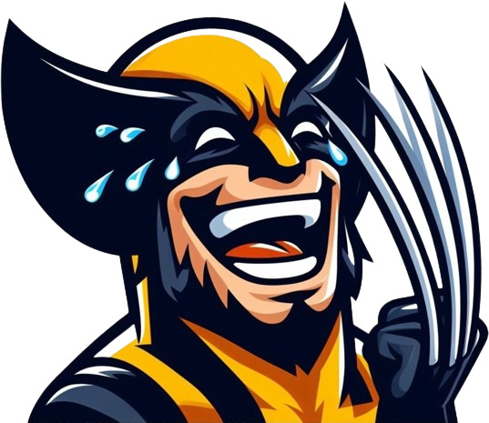
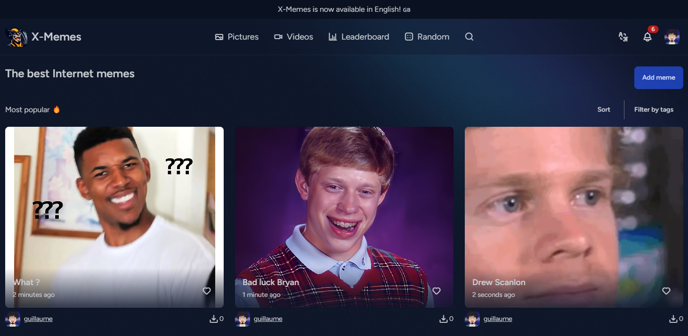

[](https://forge.laravel.com/servers/741129/sites/2186314)

<!-- PROJECT LOGO -->
<br />
<div align="center">
  <a href="https://github.com/gcazin/x-memes">
    
  </a>

<h3 align="center">X-Memes</h3>

  <p align="center">
    Retrouve tes memes préférés en un clin d'œil !
    <br />
    <br />
    <a href="https://x-memes.com">Voir le site</a>
    ·
    <a href="https://github.com/gcazin/x-memes/issues">Signaler un bug</a>
    ·
    <a href="https://github.com/gcazin/x-memes/issues">Demande de fonctionnalité</a>
  </p>
</div>

## Capture d'écran



### Construit avec

[![Laravel][Laravel.com]][Laravel-url]
[![Vue][Vue.js]][Vue-url]

## Pour commencer

Pour mettre en place une copie locale et la faire fonctionner, suivez les étapes simples de cet exemple.

### Pré-requis

### Installation

1. Cloner le repo
   ```sh
   git clone https://github.com/gcazin/x-memes.git
   ```
2. Installer les dépendances
    ```sh
   composer install
   ```
3. Installer les paquets NPM
   ```sh
   npm install
   ```
4. Démarrer le projet
    ```sh
   php artisan serve
   ```
   ```sh
   npm run dev
   ```

## Roadmap

- [ ] //

Voir les [issues](https://github.com/gcazin/x-memes/issues) pour une liste complète des fonctionnalités proposées (et des problèmes connus).

## Contribuer

Les contributions sont ce qui fait de la communauté open source un endroit extraordinaire pour apprendre, inspirer et créer. Toutes vos contributions sont **très appréciées**.

Si vous avez une suggestion qui permettrait d'améliorer ce projet, merci de forker le repo et de créer une pull request. Vous pouvez aussi simplement ouvrir un problème avec le tag "enhancement". N'oubliez pas de donner une étoile au projet ! Merci à tous !

1. Fork le projet
2. Créez votre branche de fonctionnalités (`git checkout -b feature/AmazingFeature`)
3. Commitez vos changements (`git commit -m 'Add some AmazingFeature'`)
4. Poussez vers votre branche (`git push origin feature/AmazingFeature`)
5. Ouvrez une pull request

## License

Distribué sous la licence MIT. Voir `LICENSE.txt` pour plus d'informations.

## Contact

Guillaume - [@gcazinonx](https://twitter.com/gcazinonx) - contact@guillaume-cazin.fr

Lien du projet: [https://github.com/gcazin/x-memes](https://github.com/gcazin/x-memes)

[contributors-shield]: https://img.shields.io/github/contributors/gcazin/x-memes.svg?style=for-the-badge
[contributors-url]: https://github.com/gcazin/x-memes/graphs/contributors
[forks-shield]: https://img.shields.io/github/forks/gcazin/x-memes.svg?style=for-the-badge
[forks-url]: https://github.com/gcazin/x-memes/network/members
[stars-shield]: https://img.shields.io/github/stars/gcazin/x-memes.svg?style=for-the-badge
[stars-url]: https://github.com/gcazin/x-memes/stargazers
[issues-shield]: https://img.shields.io/github/issues/gcazin/x-memes.svg?style=for-the-badge
[issues-url]: https://github.com/gcazin/x-memes/issues
[license-shield]: https://img.shields.io/github/license/gcazin/x-memes.svg?style=for-the-badge
[license-url]: https://github.com/gcazin/x-memes/blob/master/LICENSE.txt
[linkedin-shield]: https://img.shields.io/badge/-LinkedIn-black.svg?style=for-the-badge&logo=linkedin&colorB=555
[linkedin-url]: https://linkedin.com/in/linkedin_username
[product-screenshot]: images/screenshot.png
[Vue.js]: https://img.shields.io/badge/Vue.js-35495E?style=for-the-badge&logo=vuedotjs&logoColor=4FC08D
[Vue.js]: https://img.shields.io/badge/Vue.js-35495E?style=for-the-badge&logo=vuedotjs&logoColor=4FC08D
[Vue-url]: https://vuejs.org/
[Vue-url]: https://tailwindcss.css/
[Laravel.com]: https://img.shields.io/badge/Laravel-FF2D20?style=for-the-badge&logo=laravel&logoColor=white
[Laravel-url]: https://laravel.com
